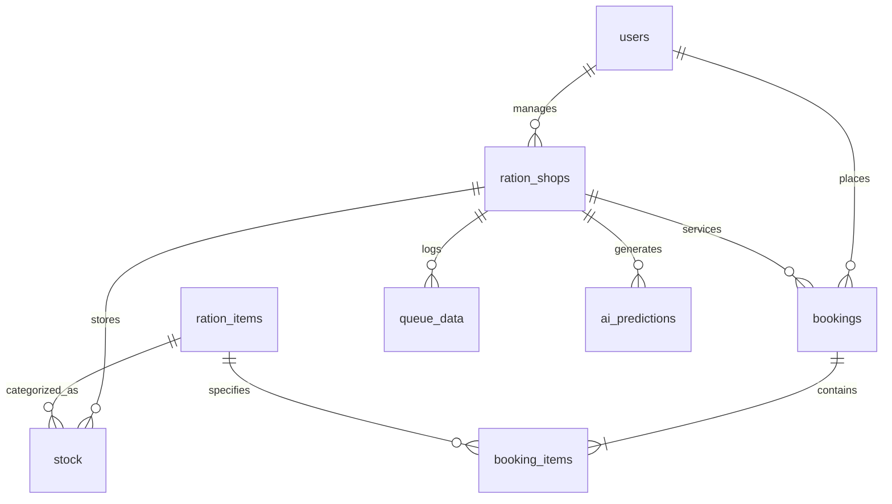

# RationSmart AI

> **Smart Ration Distribution. Predictive. Transparent. Citizen-Centric.**  
> *Smarter Ration Distribution Starts Before You Reach the Shop.*

[](https://www.python.org/)
[](https://flask.palletsprojects.com/)
[](https://scikit-learn.org/)
[](https://www.mysql.com/)
[](LICENSE)

---

## 📌 Project Overview

**RationSmart AI** is a complete, production-grade civic-tech web platform designed to modernize the Public Distribution System (PDS) / Fair Price Shops (FPS). By blending machine learning queue forecasting, real-time inventory telemetry, automated quota entitlement tracking, and tamper-resistant digital QR ration passes, RationSmart AI eliminates beneficiary congestion, guarantees food grain transparency, and empowers civil supplies authorities with actionable supply chain intelligence.

---

## ⚠️ Problem Statement

In conventional public distribution networks catering to hundreds of millions of citizens:
1. **Unpredictable Physical Queues**: Beneficiaries frequently spend 2–4 hours waiting at local Fair Price Shops without any visibility into footfall congestion.
2. **Asymmetric Stock Transparency**: Citizens arrive only to discover high-demand commodities (like Sugar or Wheat) are depleted, resulting in wasted trips and frustration.
3. **Reactive Reordering**: Depot managers and government regulators often discover stock shortages days after depletion occurred, disrupting basic food security.
4. **Paper-Based Verification**: Manual registers are prone to bottlenecks, record discrepancies, and slow checkouts.

---

## 💡 Solution

RationSmart AI replaces chaotic manual distribution with a unified digital ecosystem:
- **Pre-Visit AI Queue Forecasting**: Beneficiaries can check forecasted line lengths and expected wait times before leaving home, and receive optimal low-congestion time slot recommendations.
- **Dynamic Entitlement & Inventory Tracking**: Citizens view real-time monthly allocations and physical depot inventory for primary commodities (Rice, Wheat, Sugar).
- **Smart Booking & Digital QR Pass**: Citizens schedule their visits within authorized quotas and receive an encrypted, official digital pass with an embedded QR code containing only the booking reference ID.
- **Counter Scan & Real-Time Stock Deduction**: Shop operators verify digital tokens in seconds; completing a transaction automatically updates the relational database stock in real-time.
- **Macro Telemetry & Stock Run-Rate AI**: Government regulators access state-wide Chart.js visual analytics, 7-day transaction velocity, and automated stock shortage warnings.

---

## 🚀 Key Features

### 👤 Citizen Portal
- **Monthly Entitlement Meter**: Live tracking of remaining monthly quotas for Rice, Wheat, and Sugar.
- **Depot Stock Visibility**: Status badges (`In Stock`, `Low Stock`, `Out of Stock`) and last updated timestamps.
- **AI Queue Engine**: Real-time queue and wait time predictions for any chosen date and time slot.
- **Smart Slot Booking**: Interactive reservation modal with entitlement bounds checking.
- **Official Digital Ration Pass**: Scannable QR code token with print-friendly layout.

### 🏪 Shop Staff Portal
- **Daily Operations Desk**: Real-time counters for Today's Bookings, Pending Verifications, and Completed Dispatches.
- **One-Click Workflow Transitions**: Status updates (`Approve` ➔ `Complete`).
- **Automated MySQL Stock Deduction**: Marking a booking as `Completed` automatically decrements warehouse inventory.
- **Manual Inventory Adjust / Restock**: On-the-fly restocking modal.
- **AI Stock Shortage Alerts**: Runway analysis indicating days remaining before stock runs out.

### 🏛️ Government Admin Portal
- **State-Wide KPI Telemetry**: Total Fair Price Shops, Registered Beneficiaries, Today's Transactions, and Low-Stock Depot counts.
- **Interactive Chart.js Visualizations**:
  - *7-Day Booking vs. Completion Velocity* (Dual-line area chart)
  - *Commodity Stock Status Across Network* (Grouped bar chart)
  - *Hourly Beneficiary Footfall & Congestion Profile* (Composite bar/line chart)
- **Fair Price Shop Monitoring Table**: Real-time operational health flags (`Optimal`, `Low Stock`, `Critical Shortage`).
- **Consolidated AI Replenishment Advisories**: Automated re-order suggestions with suggested re-supply quantities.

---

## 🤖 AI / Machine Learning Functionality

> **Transparency Note**: The machine learning models in RationSmart AI are trained on **synthetic demonstration civic distribution datasets** modeled after realistic urban and rural Fair Price Shop footfall cycles.

### 1. Footfall & Queue Forecaster (`scikit-learn` + `pandas`)
- **Model**: `RandomForestRegressor(n_estimators=40, max_depth=8)`
- **Input Features**: `[day_of_week, hour_of_day, active_bookings_count]`
- **Target Outputs**:
  - `predicted_queue`: Forecasted number of beneficiaries waiting in line.
  - `wait_time_minutes`: Estimated waiting duration based on per-beneficiary service rates.
  - `rush_level`: Congestion classification (`Low Congestion`, `Moderate Congestion`, `High Congestion`, `Peak Rush`).
- **Slot Recommendation Algorithm**: Iterates through all operational slots for a given date, runs model inference incorporating booked loads, and outputs the optimal time window with minimum wait time.

### 2. Stock Depletion & Shortage Risk Engine
- **Methodology**: Empirical daily burn-rate regression and runway analysis.
- **Calculations**:
  $$\text{Net Available Stock} = \text{Current Physical Stock} - \text{Pending Reserved Stock}$$
  $$\text{Days Remaining} = \frac{\text{Net Available Stock}}{\text{Daily Consumption Rate}}$$
  $$\text{Projected 7-Day Demand} = (\text{Daily Consumption Rate} \times 7) + \text{Pending Reserved Stock}$$
- **Risk Tiers**:
  - **Critical (< 3.5 days)**: Immediate red alert; urgent emergency grain dispatch recommended.
  - **High (< 7 days)**: Yellow warning; dispatch recommended within 48 hours.
  - **Moderate (< 14 days)**: Normal weekly buffer.
  - **Optimal (> 14 days)**: Healthy inventory level.

---

## 🛠️ Technology Stack

| Layer | Technologies |
|---|---|
| **Backend** | Python 3.10+, Flask 3.x, Werkzeug |
| **Data & ML** | pandas, NumPy, scikit-learn, qrcode, Pillow |
| **Database** | MySQL 8.0+ (with automatic SQLite zero-config fallback) |
| **Frontend** | HTML5, CSS3, JavaScript (ES6+), Bootstrap 5.3, Bootstrap Icons |
| **Visualization** | Chart.js 4.x |
| **Environment** | python-dotenv, PyMySQL, Cryptography |

---

## 🗄️ Database Architecture

The relational schema (`schema.sql`) enforces referential integrity using InnoDB foreign keys and timestamps:



### Table Definitions:
1. `users`: Citizen beneficiaries, Shop staff, and Government admins with password hashes.
2. `ration_shops`: Fair Price Shop locations, zones, contact info, and assigned staff.
3. `ration_items`: Commodities (Rice, Wheat, Sugar), quota allocations, and subsidy rates.
4. `stock`: Shop inventory (current stock, reserved stock, safety thresholds, last updated).
5. `bookings`: Smart reservations, pickup date/time slot, status, and QR code token reference.
6. `booking_items`: Commodity line items and quantities tied to a booking.
7. `queue_data`: Historical queue observations used for training the AI model.
8. `ai_predictions`: Audit trail of generated forecasts and recommendations.

---

## 🔐 Security & Access Control

- **Password Hashing**: PBKDF2/scrypt password hashing via `werkzeug.security`.
- **Parameterized SQL Queries**: 100% protection against SQL injection attacks.
- **Role-Based Access Control (RBAC)**: Enforced via custom `@login_required(roles=[...])` decorators.
- **Tamper-Resistant QR Tokens**: QR code stores **only** the unique booking reference ID string (e.g. `RS-2026-8491`), preventing client-side data tampering.
- **Session Protection**: Flask signed sessions with configurable lifetimes.

---

## ⚙️ Installation & Setup

### 1. Clone & Prerequisites
Ensure Python 3.10+ is installed:
```bash
git clone https://github.com/your-username/RationSmart_AI.git
cd RationSmart_AI
```

### 2. Set Up Virtual Environment (Recommended)
```bash
# Windows
python -m venv venv
venv\Scripts\activate

# Linux / macOS
python3 -m venv venv
source venv/bin/activate
```

### 3. Install Dependencies
```bash
pip install -r requirements.txt
```

---

## 🗃️ Database Setup

### Option A: MySQL Setup (Production / Primary)
1. Start your local MySQL service.
2. Log into MySQL and import the schema:
```bash
mysql -u root -p < schema.sql
```
3. Copy environment variables:
```bash
cp .env.example .env
```
4. Edit `.env` with your database credentials:
```env
DB_TYPE=mysql
DB_HOST=localhost
DB_PORT=3306
DB_USER=root
DB_PASSWORD=your_mysql_password
DB_NAME=rationsmart_ai
SECRET_KEY=your_custom_secret_key_2026
```

### Option B: Instant Zero-Config SQLite Fallback
If MySQL is not installed on your test machine, **RationSmart AI automatically falls back to an embedded SQLite database (`rationsmart.db`)** and seeds identical tables and demo data automatically upon launch! You can also force this by setting in `.env`:
```env
DB_TYPE=sqlite
```

---

## 🚀 Running the Application

```bash
python app.py
```
Open your browser and navigate to:  
👉 **http://127.0.0.1:5000**

---

## 👥 Demo Accounts

The database comes pre-seeded with ready-to-test accounts for all three user personas:

| Role | Email / Identifier | Password | Access / Scope |
|---|---|---|---|
| **Citizen Beneficiary** | `citizen@rationsmart.gov` *(or `RC-DL-98472`)* | `citizen123` | Quota check, AI queue forecast, Smart booking, QR Digital Pass |
| **Shop Staff** | `staff@rationsmart.gov` | `staff123` | Fair Price Shop #104 desk, booking approval, stock deduction |
| **Government Admin** | `admin@rationsmart.gov` | `admin123` | State telemetry, Chart.js analytics, low-stock warnings |

*Tip: The login page includes 1-click demo buttons to automatically populate and test each profile.*

---

## 🧪 End-to-End Verification Workflow

To test the complete end-to-end lifecycle of the system:
1. **Citizen Step**:
   - Log in as **Citizen** (`citizen@rationsmart.gov` / `citizen123`).
   - Notice Rice, Wheat, Sugar monthly quotas and shop stock.
   - Click **Smart Ration Booking**.
   - Change pickup date/time slot; watch the AI Queue prediction update dynamically.
   - Confirm booking. A **Digital Ration Pass** with an authentic QR code will pop up. Note the Pass Ref ID (e.g. `RS-2026-XXXX`).
2. **Shop Staff Step**:
   - Log out and log in as **Shop Staff** (`staff@rationsmart.gov` / `staff123`).
   - Check the **Today's Bookings** table for the newly created pass.
   - Click **Approve** and then **Complete & Deduct Stock**.
   - Notice the inventory stock counts decrement in real time.
3. **Government Admin Step**:
   - Log out and log in as **Gov Admin** (`admin@rationsmart.gov` / `admin123`).
   - Inspect the interactive **Chart.js** charts (Daily Trends, Commodity Stock Distribution, Peak Congestion Hours).
   - Review AI stock alerts for low-stock depots.

---

## 🌐 API Reference

| Method | Endpoint | Description |
|---|---|---|
| `GET` | `/api/health` | Service health, active DB engine, and ML model status |
| `GET` | `/api/availability?shop_id=1` | Commodity availability, stock levels, and user quota |
| `GET` | `/api/bookings` | List user or shop bookings based on authenticated role |
| `POST` | `/api/bookings` | Create a new verified booking with stock reservation |
| `GET` | `/api/bookings/<id>` | Full booking pass details including Base64 QR code |
| `POST` | `/api/bookings/<id>/status` | Approve or Complete booking (deducts stock upon completion) |
| `POST` | `/api/queue-prediction` | AI queue size, wait time, and optimal slot recommendation |
| `GET` | `/api/stock-prediction?shop_id=1` | AI burn rate, days remaining, and shortage risk |
| `GET` | `/api/stock?shop_id=1` | Retrieve shop inventory levels |
| `POST` | `/api/stock?shop_id=1` | Replenish/adjust inventory stock |
| `GET` | `/api/government` | Aggregated government KPIs and Chart.js series data |

---

## ⚠️ Limitations & Future Roadmap

- **Demonstration Dataset**: The queue model currently utilizes synthetic multi-day observations. In production, this can be interfaced with IoT turnstiles or biometric e-PoS (electronic Point of Sale) telemetry.
- **Biometric Aadhaar / Iris Integration**: Future releases can integrate official UIDAI e-KYC for biometric authentication at the counter.
- **SMS / WhatsApp Notification Gateways**: Sending booking confirmations and token alerts via SMS for non-smartphone beneficiaries.
- **Multi-Lingual Localization**: Supporting 22 scheduled Indian languages for enhanced grassroots accessibility.

---

## 📄 License

This project is licensed under the MIT License - see the [LICENSE](LICENSE) file for details.
